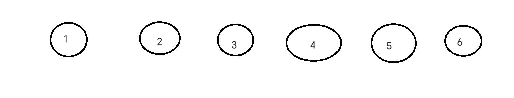

# 并查集
1.并查集是为了解决一些联通问题,也是集合的划分吧,通过union操作来把每一个点来连接起来
## quickUnion操作
1.什么是union操作呢,设想这里有一系列点
刚开始他们各自独立,互不联通,现在我们要通过下面的命令来把他们联合在一起```union(1,2),union(1,3),union(2,5),union(4,6)```
下面这就是联合后的结果

一个很自然的方法是开一个数组```arr[1]=1,arr[2]=2,arr[3]=3,arr[4]=4,arr[5]=5,arr[6]=6```
通过这些合并操作,我们再来看一下```union```函数,
```union(1,2)```,所以吧```arr[2]=1```,```union(1,3)```,那么```arr[3]=1```,依次类推,我们可以得到数组内的结果,结果如下

所以如果要查询他们是否属于同一个集合,只需要判断他们的```val```是否相同即可,如果相同,那么他们就是联通的,在同一个集合中,反之,则不在一个集合中,也不连通\
这就是```union操作```
## find
```find```函数可谓是并查集的一个亮点核心,他是这样的
```
int find(int index){
    //code here
}
```

这个函数的思路就是为了union函数而服务的,试想怎么判断是否需要将两个点给合并呢,这个时候我们就引入了代表元素的概念,在上面那个图中代表元素有```1,4```,因为这是两个集合的头目,所以,我们在判断是否属于一个集合的时候,要比较两个元素的头目是否相等,上面那个图只是一个特殊的操作,真实的合并是
```
void union(int id1,id2){
    //寻找代表结点
    int index1=find(id1);
    int index2=find(id2);
    if(index1!=index2){
        //不相等的话,把id2元素的代表集合换成id1的代表元素index1
        arr[id2]=index1;
    }
}
```

然后再处理一下```find```方法
```
//Union
int find(int id){
    //代表元素就是id=arr[id]
    while(id!=arr[id]){
        id=arr[id];
    }
    return id;
}
```
这个方法简单明了,但是却不够好,试想一下,我分别执行下面几次union
```
union(1,2)
union(1,3)
union(3,4)
union(3,2)
union(4,5)
union(5,2)

```

最终合并完就是这个数组,实际上上面的union是一种快速union的方法,而这种union方法是最普通的union方法,只需要将前者p的index的数改为后者q的index数即可
但是这也造成了一个问题,有的时候合并的情况有可能太长,而合并的数据很大,造成了一个很长的链表,所以我们需要改进一下\
这里就有一种神奇的扁平化方法
```
int find(int index){
    if(index==arr[index]){
        return;
    }
    arr[index]=find(arr[index]);
    return index;
}
```
//这几行代码就降低了数的高度,从而提高查询效率