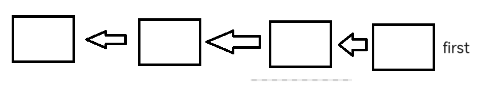

# 栈的链表形式
1.根据栈的结构，我们得逆着创建结点
```
Node first=null;
void push(T item){
    Node old=first;
    first=new Node();
    first.item=item;
    first.next=old;
}

```
最后创建的链表就是逆序形式的，非常巧妙

# 栈的数组表达形式
```
数组形式简单
int[]arr=new int[capacity];
int n=0;
void push(int item){
    arr[n++]=item
}
string pop(){
    //倒着取就行了
    return arr[n--];
}
boolean isEmpty(){
    return n==0;
}
```